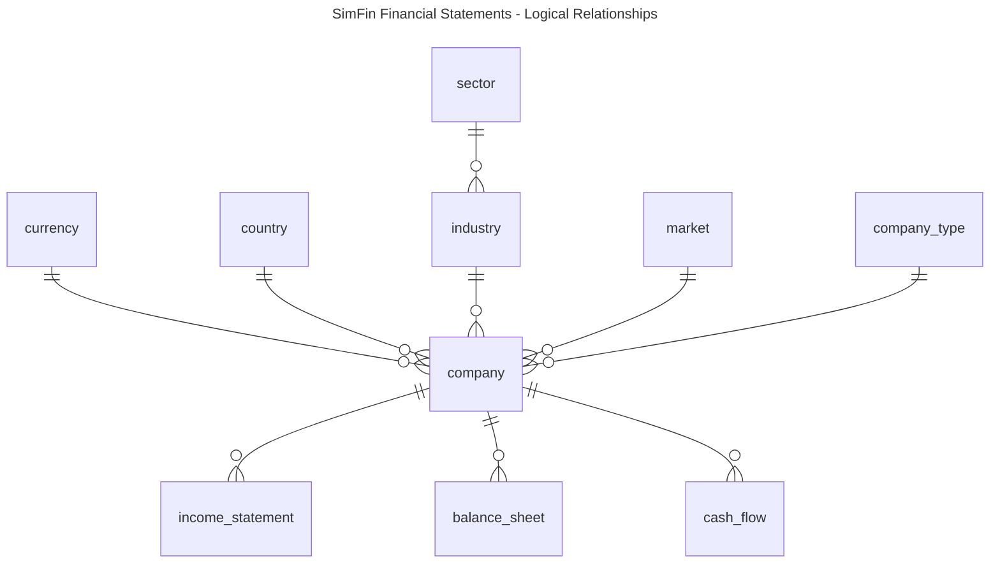

# SimFin

## Introduction

[SimFin](https://www.simfin.com/en/) is a German fintech startup offering a stock analysis platform to investors and analysts.  Part of it's offering includes bulk access to the financial statements of listed companies in the US, Canada, Germany and China.

This project uses the bulk data offered by SimFin to build a database containing the financial statements in these files.  To use the project and build the database you'll need at a minimum to create a free account with them and download the bulk data they offer.

## Database Model

The database built-in this project uses PostgreSql 16 and Ruby 3.4.1.  The main entities in the model are as follows:

There are three different types of company - standard, banks and insurance companies and as the data is different in each case there are three tables for each type of financial statement.
